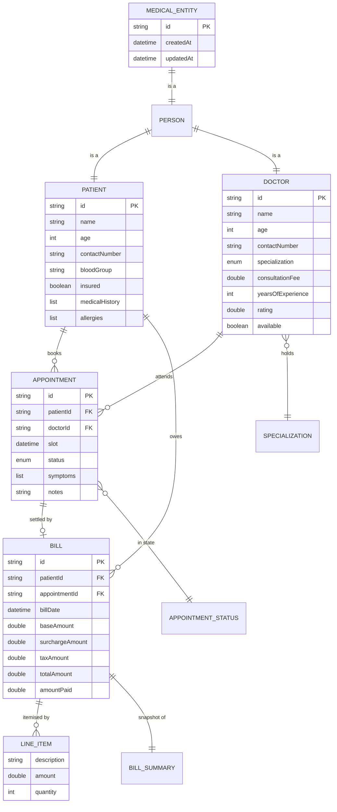
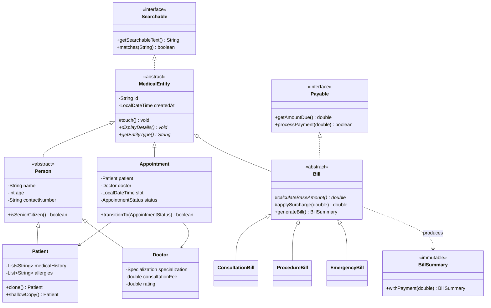
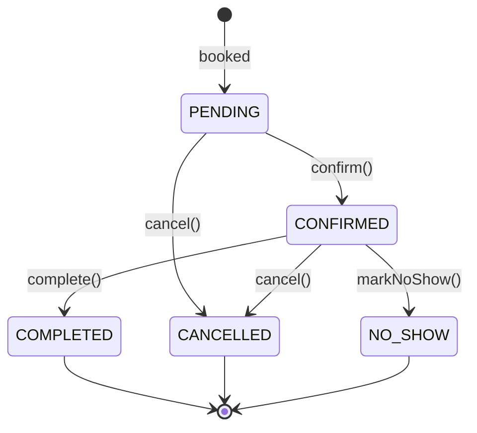

# Data & Persistence Design

> **Owner:** Sunil Kumar B A · **Phase:** 4

MediTrack has no database — the assignment is Core Java with file persistence. This document
covers the equivalent design work: the entity-relationship model, key strategy, file schemas,
referential integrity, and the SQL migration path if this ever outgrew CSV.

---

## 1. Entity-Relationship model



### Cardinality

| Relationship | Cardinality | Enforced by |
|---|---|---|
| Patient → Appointment | 1 : many | `AppointmentService.getAppointmentsForPatient()` |
| Doctor → Appointment | 1 : many | `AppointmentService.getAppointmentsForDoctor()` |
| Appointment → Bill | 1 : 0..1 | Only `COMPLETED` appointments are billable |
| Patient → Bill | 1 : many | `BillingService.getBillsForPatient()` |
| Bill → LineItem | 1 : many | Composition — items have no life outside their bill |
| Doctor → Specialization | many : 1 | Enum, so invalid values are unrepresentable |

---

## 2. Class hierarchy (the "schema" in Java terms)



---

## 3. Primary key strategy

### Format

```
<PREFIX>-<zero-padded sequence>
   PAT-0001    DOC-0042    APT-0137    BIL-0009
```

| Prefix | Entity | Constant |
|---|---|---|
| `PAT` | Patient | `Constants.PATIENT_ID_PREFIX` |
| `DOC` | Doctor | `Constants.DOCTOR_ID_PREFIX` |
| `APT` | Appointment | `Constants.APPOINTMENT_ID_PREFIX` |
| `BIL` | Bill | `Constants.BILL_ID_PREFIX` |

### Why this format over the alternatives

| Option | Rejected because |
|---|---|
| `UUID` | 36 unreadable characters. A clinic receptionist reads ids aloud. |
| Bare integers | `1` is ambiguous — patient 1 or doctor 1? The prefix is self-describing. |
| Name-based (`ravi-kumar-01`) | Names are not unique and change on marriage; PII in a key. |

### Generation and collision safety

`IdGenerator` holds one `AtomicInteger` per prefix. `incrementAndGet()` is a single atomic
operation, unlike `count++` which is a read-modify-write that loses updates under contention.

**Verified:** `TestRunner` spawns 10 threads generating 100 ids each and asserts 1,000 *unique*
ids — zero collisions.

### Counter synchronisation after import

Loading `PAT-0007` from CSV must not let the next generated id be `PAT-0001`. Every
`register()` call routes through `IdGenerator.syncFromId()`:

```java
counters.computeIfAbsent(prefix, k -> new AtomicInteger(0))
        .accumulateAndGet(value, Math::max);
```

`accumulateAndGet` with `Math::max` is atomic and **monotonic** — a concurrent `nextId()` cannot
interleave and lose the update, and a lower id can never move the counter backwards. Both
properties are asserted in the test suite.

---

## 4. File schemas

All files live in `Constants.DATA_DIR` (default `data/`, overridable via the
`MEDITRACK_DATA_DIR` environment variable — resolved once in a static block).

### 4.1 `patients.csv`

```csv
id,name,age,contactNumber,bloodGroup,insured,medicalHistory,allergies
PAT-0001,Ravi Kumar,67,9812345670,O+,false,Hypertension diagnosed 2021,Penicillin
PAT-0002,Meera Joshi,34,9812345671,A+,true,Migraine|| recurring,
PAT-0003,Aditya Verma,8,9812345672,B+,true,,Peanuts
```

| Column | Type | Null? | Notes |
|---|---|---|---|
| `id` | String | No | PK, `PAT-####` |
| `name` | String | No | 2–50 chars, letters/spaces/hyphens/apostrophes |
| `age` | int | No | 0–120 |
| `contactNumber` | String | No | 10 digits, starts 6–9 |
| `bloodGroup` | String | Yes | `A|B|AB|O` + `+|-` |
| `insured` | boolean | No | Drives strategy selection |
| `medicalHistory` | List | Yes | `;`-delimited |
| `allergies` | List | Yes | `;`-delimited |

> Note row `PAT-0002`: the original value was `"Migraine, recurring"`. The comma is escaped to
> `||` so `String.split(",")` cannot shift the remaining columns.

### 4.2 `doctors.csv`

```csv
id,name,age,contactNumber,specialization,consultationFee,yearsOfExperience,rating,available
DOC-0001,Anita Rao,44,9876543210,CARDIOLOGY,1400.0,16,4.8,true
DOC-0003,Priya Sharma,33,9876543212,DERMATOLOGY,850.0,6,4.9,true
```

| Column | Type | Null? | Notes |
|---|---|---|---|
| `id` | String | No | PK, `DOC-####` |
| `specialization` | Enum | No | Enum **name**, not display name — stable across UI changes |
| `consultationFee` | double | No | ≥ 0, ≤ 1,000,000 |
| `rating` | double | No | 0.0–5.0 |
| `available` | boolean | No | Unavailable doctors cannot be booked |

Unknown speciality values degrade to `GENERAL_PRACTICE` rather than failing the import.

### 4.3 `appointments.csv`

```csv
id,patientId,doctorId,slot,status,symptoms,notes
APT-0001,PAT-0001,DOC-0001,2026-07-26 10:00,PENDING,chest pain;breathless,
APT-0002,PAT-0002,DOC-0002,2026-07-26 11:00,PENDING,headache;migraine,
```

| Column | Type | Null? | Notes |
|---|---|---|---|
| `id` | String | No | PK, `APT-####` |
| `patientId` | String | No | **FK** → `patients.id` |
| `doctorId` | String | No | **FK** → `doctors.id` |
| `slot` | DateTime | No | `yyyy-MM-dd HH:mm`, aligned to 30-min boundary |
| `status` | Enum | No | Enum name |
| `symptoms` | List | Yes | `;`-delimited |

**The object graph is flattened to foreign keys.** Nesting a full patient record inside every
appointment row would duplicate data and make updates inconsistent — the CSV equivalent of
normalisation.

---

## 5. Referential integrity

CSV cannot enforce foreign keys, so the application does it on load.

```java
Patient patient = patients.get(unescape(f[1]));
Doctor  doctor  = doctors.get(unescape(f[2]));
if (patient == null || doctor == null) {
    return null;   // orphaned row — skipped, not loaded with nulls
}
```

### Load order matters

```
1. doctors.csv       (no dependencies)
2. patients.csv      (no dependencies)
3. appointments.csv  (depends on BOTH — loaded last, re-linked in memory)
```

`Main.loadAllData()` enforces this order, passing `patientService.asMap()` and
`doctorService.asMap()` into the appointment loader.

### Integrity rules

| Rule | Enforced by | On violation |
|---|---|---|
| Appointment must reference a real patient and doctor | `CSVUtil.appointmentFromCsvRow()` | Row skipped |
| A doctor cannot hold two live appointments in one slot | `AppointmentService.isDoctorBooked()` | `SlotUnavailableException` |
| Max 8 appointments per doctor per day | `Constants.MAX_APPOINTMENTS_PER_DOCTOR_PER_DAY` | `SlotUnavailableException` |
| Only `COMPLETED` appointments are billable | `AppointmentStatus.isBillable()` | `InvalidDataException` |
| Status changes follow the state machine | `AppointmentStatus.canTransitionTo()` | Transition refused |
| Ids are unique | `IdGenerator` + `Map` keying | Later save replaces earlier |
| Payment cannot exceed the balance | `Bill.processPayment()` | Returns `false` |

### The appointment state machine



Terminal states admit no further transitions. Asserted in `TestRunner`: *"cannot cancel a
COMPLETED appointment"*, *"PENDING cannot jump straight to COMPLETED"*.

---

## 6. Escaping rules

| Character | Stored as | Why |
|---|---|---|
| `,` | `||` | Would split the row into extra columns |
| `\n`, `\r` | space | Would split the row into extra records |
| list separator | `;` | Multi-valued fields inside one cell |
| `null` | empty string | Distinguished from a legitimately empty string on read |

Round-tripping is asserted: `"condition, with comma"` survives write → read intact.

---

## 7. Serialization (secondary format)

`DataStore<T>` also supports Java serialization for whole-store snapshots:

```java
store.serializeTo("data/meditrack.ser");
int loaded = store.deserializeFrom("data/meditrack.ser");
```

| Aspect | Decision |
|---|---|
| `serialVersionUID` | Explicit `= 1L` on every entity — without it, any field change breaks old files |
| `transient` fields | `Bill.billingStrategy` — behaviour, not data, and often a non-serializable lambda |
| Resource handling | try-with-resources; `IOException`/`ClassNotFoundException` wrapped in `DataPersistenceException` |

**Why CSV remains primary:** serialization is opaque, brittle across class changes, and
Java-only. A reviewer can `cat data/patients.csv`.

---

## 8. In-memory storage

`DataStore<T extends MedicalEntity>` backs every service.

```java
private final Map<String, T> storage = new LinkedHashMap<>();
```

| Choice | Reason |
|---|---|
| `Map` keyed by id | O(1) lookup — the dominant operation |
| `LinkedHashMap` | Insertion-ordered iteration → stable output across runs |
| Generic with `extends MedicalEntity` bound | One implementation; the bound proves `getId()` and `matches()` exist |
| `Iterable<T>` | For-each support without exposing the map |
| Read-only iterator | `remove()` throws — deletions must go through `deleteById()` |

### Complexity

| Operation | Complexity |
|---|---|
| `save` / `findById` / `exists` / `deleteById` | O(1) |
| `findAll` / `search` / `findBy` | O(n) |
| `findAllSorted` | O(n log n) |
| `getAvailableSlots` | O(n × s), n appointments × s slots per day |

At clinic scale (hundreds of records) the linear scans are irrelevant. At hospital scale they
would need indexing — the point at which you would move to a real database.

---

## 9. SQL migration path

If MediTrack outgrew CSV, this is the schema it would become. The design already anticipates it —
which is why appointments store foreign keys rather than nested objects.

```sql
CREATE TABLE person (
    id              VARCHAR(12)  PRIMARY KEY,
    person_type     VARCHAR(10)  NOT NULL CHECK (person_type IN ('PATIENT','DOCTOR')),
    name            VARCHAR(50)  NOT NULL,
    age             SMALLINT     NOT NULL CHECK (age BETWEEN 0 AND 120),
    contact_number  CHAR(10)     NOT NULL,
    email           VARCHAR(120),
    created_at      TIMESTAMP    NOT NULL DEFAULT CURRENT_TIMESTAMP,
    updated_at      TIMESTAMP    NOT NULL DEFAULT CURRENT_TIMESTAMP
);

CREATE TABLE patient (
    id           VARCHAR(12) PRIMARY KEY REFERENCES person(id) ON DELETE CASCADE,
    blood_group  VARCHAR(3),
    insured      BOOLEAN     NOT NULL DEFAULT FALSE
);

CREATE TABLE patient_history (
    id          BIGSERIAL   PRIMARY KEY,
    patient_id  VARCHAR(12) NOT NULL REFERENCES patient(id) ON DELETE CASCADE,
    entry_type  VARCHAR(10) NOT NULL CHECK (entry_type IN ('HISTORY','ALLERGY')),
    entry_text  TEXT        NOT NULL
);

CREATE TABLE doctor (
    id                  VARCHAR(12)   PRIMARY KEY REFERENCES person(id) ON DELETE CASCADE,
    specialization      VARCHAR(20)   NOT NULL,
    consultation_fee    NUMERIC(10,2) NOT NULL CHECK (consultation_fee >= 0),
    years_of_experience SMALLINT      NOT NULL DEFAULT 0,
    rating              NUMERIC(2,1)  NOT NULL DEFAULT 0 CHECK (rating BETWEEN 0 AND 5),
    available           BOOLEAN       NOT NULL DEFAULT TRUE
);

CREATE TABLE appointment (
    id          VARCHAR(12) PRIMARY KEY,
    patient_id  VARCHAR(12) NOT NULL REFERENCES patient(id),
    doctor_id   VARCHAR(12) NOT NULL REFERENCES doctor(id),
    slot        TIMESTAMP   NOT NULL,
    status      VARCHAR(12) NOT NULL DEFAULT 'PENDING',
    notes       TEXT,
    -- The double-booking rule, enforced by the database rather than the service layer
    CONSTRAINT uq_doctor_slot UNIQUE (doctor_id, slot)
);

CREATE TABLE bill (
    id               VARCHAR(12)   PRIMARY KEY,
    patient_id       VARCHAR(12)   NOT NULL REFERENCES patient(id),
    appointment_id   VARCHAR(12)   REFERENCES appointment(id),
    bill_type        VARCHAR(15)   NOT NULL,
    base_amount      NUMERIC(12,2) NOT NULL,
    surcharge_amount NUMERIC(12,2) NOT NULL DEFAULT 0,
    tax_amount       NUMERIC(12,2) NOT NULL DEFAULT 0,
    total_amount     NUMERIC(12,2) NOT NULL,
    amount_paid      NUMERIC(12,2) NOT NULL DEFAULT 0,
    bill_date        TIMESTAMP     NOT NULL DEFAULT CURRENT_TIMESTAMP,
    CONSTRAINT chk_paid CHECK (amount_paid <= total_amount)
);

CREATE TABLE bill_line_item (
    id          BIGSERIAL     PRIMARY KEY,
    bill_id     VARCHAR(12)   NOT NULL REFERENCES bill(id) ON DELETE CASCADE,
    description VARCHAR(120)  NOT NULL,
    amount      NUMERIC(10,2) NOT NULL,
    quantity    SMALLINT      NOT NULL DEFAULT 1
);

CREATE INDEX idx_appointment_doctor_slot ON appointment(doctor_id, slot);
CREATE INDEX idx_appointment_patient     ON appointment(patient_id);
CREATE INDEX idx_bill_patient            ON bill(patient_id);
```

### Notable translations

| Java | SQL | Note |
|---|---|---|
| `Patient extends Person` | Two tables sharing a PK | Class Table Inheritance |
| `List<String> medicalHistory` | `patient_history` table | 1NF — repeating groups become rows |
| `Specialization` enum | `VARCHAR` + `CHECK`, or a native `ENUM` | |
| `double` for money | `NUMERIC(12,2)` | **Real change needed:** `double` cannot represent `0.1` exactly. Acceptable in a teaching project; not in production billing. |
| `isDoctorBooked()` | `UNIQUE (doctor_id, slot)` | The database enforces it atomically — no race window |

---

## 10. Data volume

| Entity | Typical | Bytes/record | 1,000 records |
|---|---|---|---|
| Patient | 500 | ~200 | ~200 KB |
| Doctor | 20 | ~120 | ~120 KB |
| Appointment | 5,000 | ~110 | ~110 KB |
| Bill | 5,000 | ~180 | ~180 KB |

Entirely comfortable in memory. The design would need revisiting somewhere around 10⁵ records
per entity — well beyond a single clinic.

---

*Part of the [MediTrack documentation set](./). See also
[Design_Decisions.md](./Design_Decisions.md) and [JVM_Report.md](./JVM_Report.md).*
