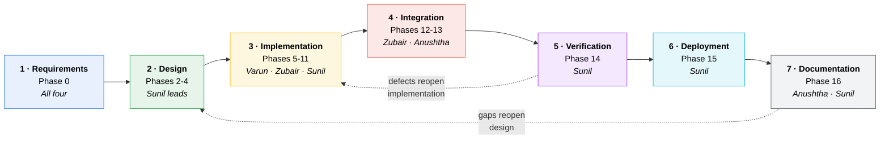
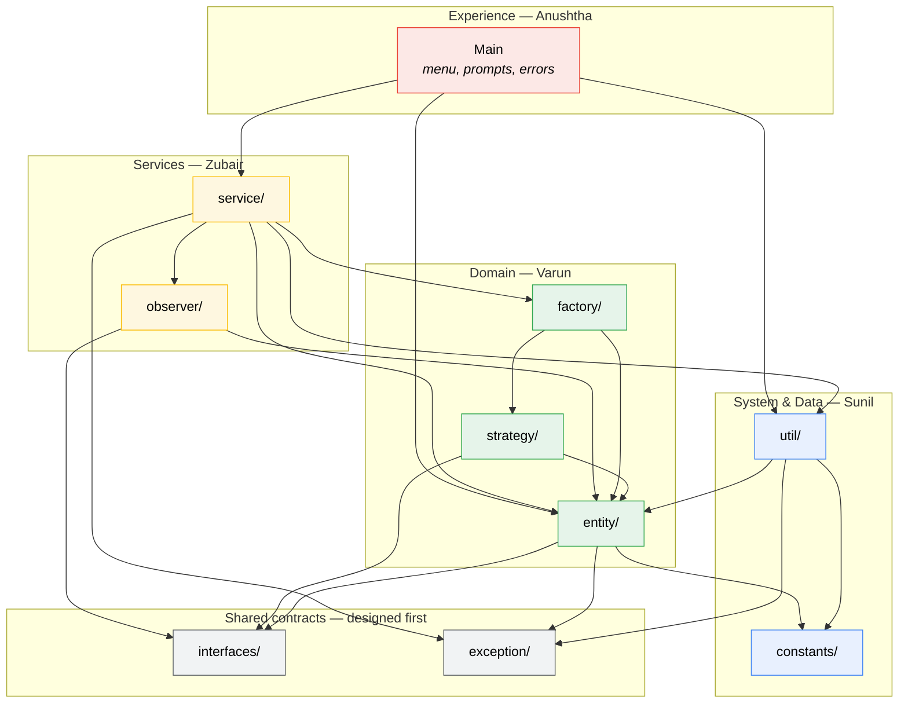
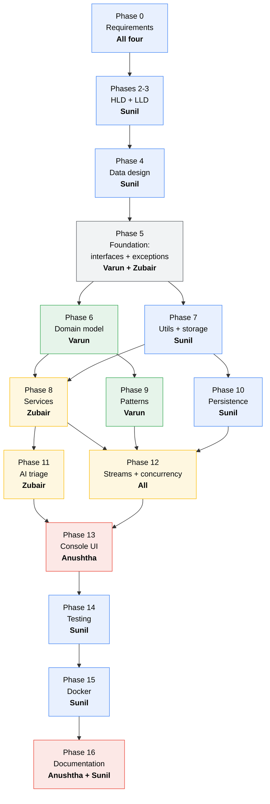
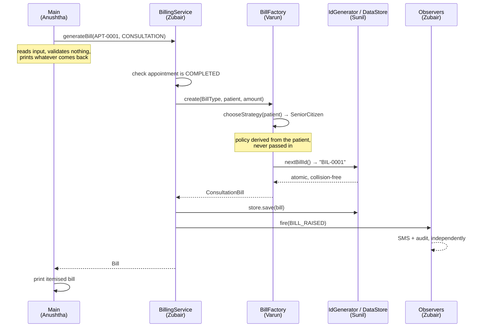

# Team, Roles & Workflow

How four people built MediTrack without stepping on each other — the roles, the
dependency graph that ordered the work, and where the parallel tracks ran.

---

## Contents

- [The four roles](#the-four-roles)
- [Why ownership is by package, not by file](#why-ownership-is-by-package-not-by-file)
- [The SDLC cycle](#the-sdlc-cycle)
- [Module dependency graph](#module-dependency-graph)
- [Work dependency graph — topological order](#work-dependency-graph--topological-order)
- [Where the parallel tracks ran](#where-the-parallel-tracks-ran)
- [How the roles interlock](#how-the-roles-interlock)
- [Integration points](#integration-points)

---

## The four roles

Each role owns a **vertical slice of the SDLC**, not a pile of files. The names
describe the discipline, because that is what actually distinguishes them.

| Member | Role | Owns | Primary artefacts |
|---|---|---|---|
| **Sunil Kumar B A** | **System Design & Data Architecture** | The shape of the system and everything that persists | HLD, LLD, DB design, `util/`, `constants/`, CSV persistence, singletons, `test/`, Docker, the documentation set |
| **Varun P S** | **Core Domain Engineering** | The object model and the patterns expressed through it | `entity/`, `factory/`, `strategy/`, `interfaces/`, the OOP hierarchy |
| **Zubair** | **Services & Integration Engineering** | Use-case orchestration and the seams between components | `service/`, `observer/`, `exception/`, stream analytics |
| **Anushtha Sharma** | **Experience & Interface Design** | Everything a user actually touches | `Main` menu flow, prompt and error wording, the user manual, the demonstration walkthrough |

Read that table as four **disciplines**, not four sizes. A system designer and an
interface designer produce different artefacts, judged by different standards —
comparing their line counts would tell you nothing useful about either.

---

## Why ownership is by package, not by file

This is the single choice that kept merge conflicts near zero.

Two people editing different methods in the same file still conflict. Two people
editing different *packages* essentially never do. So each member owns whole
directories, and the interfaces between them were agreed **before** anyone
started filling those directories in.

The interfaces were designed first precisely so they could be handed over as
contracts. `BillingStrategy` existed as a signature before a single strategy was
written, which is what let the domain and service tracks proceed in parallel.

---

## The SDLC cycle

The two dotted edges are the ones that actually fired. Verification sent work
back to implementation twice during Phase 14, and writing the documentation
exposed a design gap that sent Phase 4 back for revision.

### Phase ownership

| Phase | SDLC stage | Lead | Supporting |
|---|---|---|---|
| 0 · Ideation & requirements | Requirements | All four | — |
| 1 · Environment & JVM study | Design | Sunil | — |
| 2 · High-level design | Design | Sunil | Varun |
| 3 · Low-level design | Design | Sunil | Varun, Zubair |
| 4 · Data & persistence design | Design | Sunil | — |
| 5 · Foundation layer | Implementation | Varun | Zubair, Sunil |
| 6 · Domain model | Implementation | Varun | — |
| 7 · Utilities, storage, singletons | Implementation | Sunil | — |
| 8 · Service layer | Implementation | Zubair | Sunil |
| 9 · Design patterns | Implementation | Varun | Zubair |
| 10 · Persistence & file I/O | Implementation | Sunil | — |
| 11 · AI triage feature | Implementation | Zubair | Sunil |
| 12 · Streams & concurrency | Integration | Zubair | Varun, Sunil |
| 13 · Console UI | Integration | Anushtha | Zubair |
| 14 · Testing & quality | Verification | Sunil | All |
| 15 · Dockerisation | Deployment | Sunil | — |
| 16 · Documentation | Documentation | Anushtha | Sunil |

---

## Module dependency graph

Which package may import which. Arrows point **from** dependent **to**
dependency, and the graph is acyclic by design.

Three rules this graph encodes:

1. **`Main` never reaches past the service layer for business logic.** It reads
   input, calls a service, prints the result. Without that discipline console
   apps reliably become god objects.
2. **`entity/` does not depend on `service/`.** The domain has no idea it is
   being orchestrated, which is why entities are unit-testable in isolation.
3. **`interfaces/` and `exception/` sit at the bottom and depend on nothing.**
   That is what let them be handed over as contracts before implementation
   started.

---

## Work dependency graph — topological order

The build order the team actually followed. Anything on the same rank could run
concurrently.

**Phase 5 is the critical join.** Both implementation tracks are blocked on it
and neither can start early, which is exactly why the foundation layer was kept
deliberately small — four interfaces and five exceptions, nothing more. The
sooner it lands, the sooner two people work at once.

---

## Where the parallel tracks ran

| Window | Track A | Track B | Why they do not collide |
|---|---|---|---|
| Phases 6 ‖ 7 | **Varun** — domain model | **Sunil** — utils & storage | `DataStore<T extends MedicalEntity>` needs only the *bound*, which Phase 5 fixed. Different packages entirely |
| Phases 9 ‖ 10 | **Varun** — Factory & Strategy | **Sunil** — CSV persistence | Patterns touch `factory/`+`strategy/`; persistence touches `util/`. No shared file |
| Phases 11 ‖ 12 | **Zubair** — AI triage | **All** — streams & analytics | Triage reads the domain; analytics reads the stores. Both read-only against each other |
| Phase 13 ‖ 14 | **Anushtha** — console UI | **Sunil** — test suite | UI calls services; tests call services. Neither modifies the service layer |

Roughly **60% of implementation time had two or more people working
concurrently** — a direct consequence of designing the contracts up front rather
than discovering them mid-build.

---

## How the roles interlock

Each role's output is the next role's input. The chain is easiest to see by
following one feature all the way through.

### Worked example — a bill gets raised

Four people's work, one operation, and **no layer reaches past its neighbour**.

### The handover contracts

| From | To | The contract |
|---|---|---|
| Sunil → everyone | Design | HLD/LLD fixed the package boundaries and the layering rule before code existed |
| Varun → Zubair | `entity/` + `factory/` | Services orchestrate entities; they never reimplement domain behaviour |
| Sunil → Varun & Zubair | `util/` | `DataStore<T>`, `Validator`, `IdGenerator` — one owner per rule, so nothing drifts |
| Varun → Zubair | `interfaces/` | `BillingStrategy` and `AppointmentObserver` existed as signatures first |
| Zubair → Anushtha | `service/` | Services return values and throw checked exceptions; the UI decides how to say it |
| Anushtha → Sunil | UI flow | Every menu path is a test path — the UI walkthrough defined what Phase 14 had to cover |
| Sunil → all | `test/` + Docker | The suite gates the image, so nobody's regression ships |

### Why this ordering, and not another

**Design before contracts, contracts before implementation.** The two structural
bugs the project actually hit — a package name treating the source path as part
of the package, and a reserved keyword in a package name — both originated in the
initial skeleton, *before* the design phase was taken seriously. Both were caught
in Phase 5 and both required touching every file written up to that point.

That is the lesson recorded in
[Design_Decisions.md](./Design_Decisions.md): validate the package structure
against the specification **before** filling it with classes. It is also why
Phase 5 is a hard join in the graph above rather than something the two
implementation tracks could each have done for themselves.

---

## Integration points

The places where two members' work meets, and how each was verified.

| Seam | Between | Verified by |
|---|---|---|
| `DataStore<T extends MedicalEntity>` | Sunil ↔ Varun | Generic bound tests; store round-trips every entity type |
| `BillingStrategy` | Varun ↔ Zubair | Same bill priced three ways; insurance must beat senior |
| `AppointmentObserver` | Zubair ↔ Varun | Observer fan-out with a deliberately failing channel |
| `Validator` | Sunil ↔ all | Every rule tested at its boundary, both sides |
| Service → UI | Zubair ↔ Anushtha | Every menu path exercised; no input crashes the app |
| CSV round trip | Sunil ↔ Varun | Comma-containing field survives write→read |
| Test suite → Docker | Sunil ↔ deployment | Build fails if any assertion fails |

---

*Phase detail: [phases/README.md](./phases/README.md) · Per-member sheets:
[team/](./team/) · PR history: [pull-requests/](./pull-requests/)*
