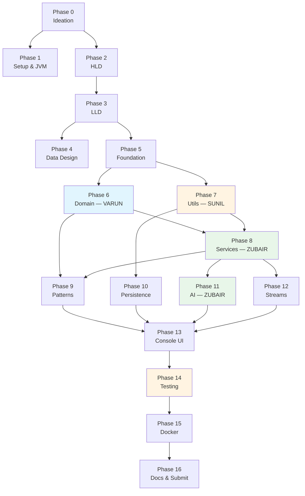

# MediTrack — Phase Plan (Phase 0 → Phase 16)

> Master index. Every phase has its own file with tasks, owners and checkboxes.
> **Status legend:** ✅ complete · 🟡 in progress · ⬜ not started

---

## Overall progress

```
Phase  0 ██████████ 100%   Ideation & Requirements
Phase  1 ██████████ 100%   Environment Setup & JVM
Phase  2 ██████████ 100%   High-Level Design
Phase  3 ██████████ 100%   Low-Level Design
Phase  4 ██████████ 100%   Data & Persistence Design
Phase  5 ██████████ 100%   Foundation Layer
Phase  6 ██████████ 100%   Domain Model
Phase  7 ██████████ 100%   Utilities, Storage & Singletons
Phase  8 ██████████ 100%   Service Layer
Phase  9 ██████████ 100%   Design Patterns
Phase 10 ██████████ 100%   Persistence & File I/O
Phase 11 ██████████ 100%   AI Feature
Phase 12 ██████████ 100%   Streams, Analytics & Concurrency
Phase 13 ██████████ 100%   Console UI
Phase 14 ██████████ 100%   Testing & Quality
Phase 15 ██████████ 100%   Dockerization
Phase 16 ████████░░  80%   Documentation & Submission
```

**Code: complete and verified.** 325/325 tests pass, Docker image builds and runs.
**Remaining: submission-only tasks** that require human action — screenshots, the walkthrough
video, PR review/merge, and the submission email. See [Phase 16](./PHASE_16_DOCUMENTATION.md).

---

## Phase index

| # | Phase | Owner(s) | Status | File |
|---|---|---|---|---|
| 0 | Ideation & Requirements | All | ✅ | [PHASE_00](./PHASE_00_IDEATION.md) |
| 1 | Environment Setup & JVM | Sunil | ✅ | [PHASE_01](./PHASE_01_SETUP_JVM.md) |
| 2 | High-Level Design | All | ✅ | [PHASE_02](./PHASE_02_HLD.md) |
| 3 | Low-Level Design | All | ✅ | [PHASE_03](./PHASE_03_LLD.md) |
| 4 | Data & Persistence Design | Sunil | ✅ | [PHASE_04](./PHASE_04_DATA_DESIGN.md) |
| 5 | Foundation Layer | Varun + Zubair | ✅ | [PHASE_05](./PHASE_05_FOUNDATION.md) |
| 6 | Domain Model | **Varun** | ✅ | [PHASE_06](./PHASE_06_DOMAIN_MODEL.md) |
| 7 | Utilities, Storage & Singletons | **Sunil** | ✅ | [PHASE_07](./PHASE_07_UTILS_STORAGE.md) |
| 8 | Service Layer | **Zubair** | ✅ | [PHASE_08](./PHASE_08_SERVICES.md) |
| 9 | Design Patterns | Varun + Zubair | ✅ | [PHASE_09](./PHASE_09_PATTERNS.md) |
| 10 | Persistence & File I/O | Sunil | ✅ | [PHASE_10](./PHASE_10_PERSISTENCE.md) |
| 11 | AI Feature | **Zubair** | ✅ | [PHASE_11](./PHASE_11_AI_FEATURE.md) |
| 12 | Streams, Analytics & Concurrency | All | ✅ | [PHASE_12](./PHASE_12_STREAMS_CONCURRENCY.md) |
| 13 | Console UI | All | ✅ | [PHASE_13](./PHASE_13_CONSOLE_UI.md) |
| 14 | Testing & Quality | **Sunil** | ✅ | [PHASE_14](./PHASE_14_TESTING.md) |
| 15 | Dockerization | Sunil | ✅ | [PHASE_15](./PHASE_15_DOCKER.md) |
| 16 | Documentation & Submission | All | 🟡 | [PHASE_16](./PHASE_16_DOCUMENTATION.md) |

---

## Dependency graph — what blocks what



---

## Parallelisation — what runs at the same time

Phase 5 is the synchronisation point. After it lands, the three members work concurrently on
disjoint packages, which is what keeps merge conflicts near zero.

| Track | Varun | Zubair | Sunil |
|---|---|---|---|
| **Wave 1** — sequential | Phase 5 (interfaces) | Phase 5 (exceptions) | Phase 1 (JVM docs) |
| **Wave 2** — parallel | **Phase 6** `entity/` | *(blocked — waits on 6 & 7)* | **Phase 7** `util/` |
| **Wave 3** — parallel | Phase 9 `factory/`, `strategy/` | **Phase 8** `service/` | Phase 10 persistence |
| **Wave 4** — parallel | Phase 12 (streams in entities) | **Phase 11** `AIHelper`, `observer/` | **Phase 14** `TestRunner` |
| **Wave 5** — joint | Phase 13 Console UI | Phase 13 Console UI | Phase 15 Docker |
| **Wave 6** — joint | Phase 16 docs | Phase 16 docs | Phase 16 docs |

### Why this split produces few conflicts

Each member owns whole **packages**, not files inside a shared package:

| Member | Owns | Touches nothing in |
|---|---|---|
| Varun | `entity/`, `factory/`, `strategy/` | `service/`, `util/` |
| Zubair | `service/`, `observer/`, `exception/`, `AIHelper` | `entity/`, `util/` |
| Sunil | `util/`, `test/`, `docs/`, Docker | `entity/`, `service/` |

The shared files — `Main.java`, `interfaces/` — are the only real conflict surface, which is why
they are scheduled in Wave 5 as joint work rather than raced on earlier.

---

## Ownership by member

| Member | Phases owned | Detailed task file |
|---|---|---|
| **Varun P S** | 5, 6, 9, 12 | [team/VARUN.md](../team/VARUN.md) |
| **Zubair** | 5, 8, 11, 12 | [team/ZUBAIR.md](../team/ZUBAIR.md) |
| **Sunil Kumar B A** | 1, 4, 7, 10, 14, 15 | [team/SUNIL.md](../team/SUNIL.md) |

---

## Rubric coverage

| Rubric item | Points | Phase | Status |
|---|---|---|---|
| Environment Setup & JVM | 10 | 1 | ✅ |
| Package Structure & Java Basics | 10 | 5 | ✅ |
| Encapsulation | 8 | 6, 7 | ✅ |
| Inheritance | 10 | 6 | ✅ |
| Polymorphism | 7 | 6, 8 | ✅ |
| Abstraction & Interfaces | 10 | 5, 6 | ✅ |
| Advanced OOP (clone, immutable, enums, static) | — | 6 | ✅ |
| Application Logic | 15 | 8, 13 | ✅ |
| **Bonus A** — File I/O & Persistence | 10 | 10 | ✅ |
| **Bonus B** — Design Patterns | 10 | 9 | ✅ |
| **Bonus C** — AI Feature | 10 | 11 | ✅ |
| **Bonus D** — Streams & Lambdas | 10 | 12 | ✅ |

The brief asks for **any two** bonuses. All four are implemented.

---

## Git workflow

`main` is protected — no direct pushes. Every phase lands through a PR.

```bash
git checkout main && git pull origin main
git checkout -b feature/<phase-name>
# ... work ...
git add -A && git commit -m "Phase N: <what changed>"
git push -u origin feature/<phase-name>
# Open a PR, get one approval, merge
```

Branch naming: `feature/*` for code, `docs/*` for documentation, `fix/*` for corrections.

PR records live in [docs/pull-requests/](../pull-requests/).

---

*Back to the [documentation index](../).*
